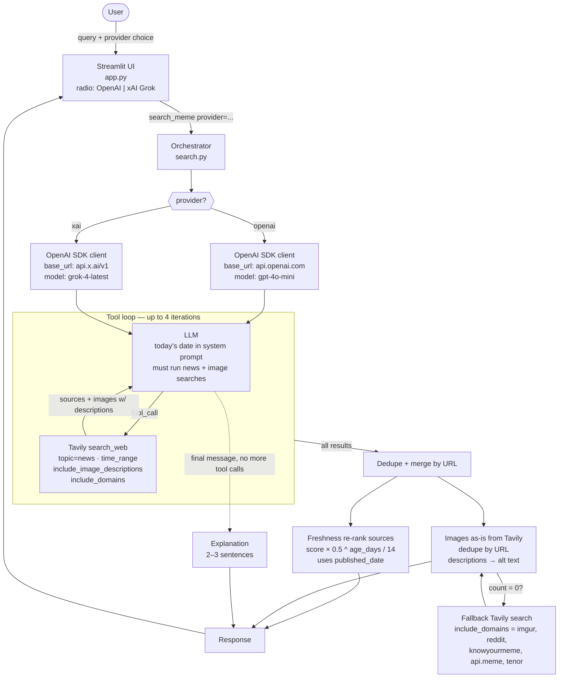

# Stampy Trend Scout

LLM-steered web search for memes and current trends. Ships with a **provider toggle** so we can A/B OpenAI `gpt-4o-mini` against xAI `grok-4-latest` on the same tool chain.

## Quick start

```bash
pip install -r requirements.txt
streamlit run app.py
```

Requires in `.env`:
- `OPENAI_API_KEY`
- `XAI_API_KEY`
- `TAVILY_API_KEY`

Pick the provider from the dropdown in the UI.

## Architecture



### Why this shape of A/B

Both providers are OpenAI-compatible, so swapping `base_url` + `model` lets us hold the tool chain constant. Any behavioural difference comes from the LLM itself — how aggressive it is with `time_range=day`, which domains it picks for the image pass, how it phrases queries. If Grok wins here, the LLM is the lever. If it's a wash, the next experiment is moving Grok to the Responses API with its native `web_search` tool (deeper integration, real-time X data).

### Block notes

- **Today's date in system prompt** — stops either LLM from defaulting to training-data recency (fixes "Bieber at Coachella" returning 2023).
- **Provider switch** — single `OpenAI` SDK client with `base_url` swap. Zero duplication in the tool loop.
- **Tool loop** — up to 4 `search_web` calls so the model can do news + image + follow-ups before synthesis.
- **Freshness re-rank** — multiplicative time decay over Tavily's relevance score: `score × 0.5 ^ (age_days / 14)`. No embeddings, pure post-filter. Decay term only from arXiv 2509.19376.
- **Images** — taken as-is from Tavily. The old HTTP-HEAD validator is **removed** (it was silently dropping valid URLs whose HEAD requests were slow or blocked — that's what caused "Trump as Jesus" to return zero). `include_image_descriptions` feeds alt text, not filtering.
- **Image fallback** — if Tavily returns zero images across all LLM-issued searches, re-run a dedicated Tavily call scoped to image-heavy domains.

### Not yet wired

- **xAI Responses API + native `web_search`** — real-time web + X, `enable_image_understanding`. The deeper Grok integration, queued behind the same-tools A/B above.
- **pytrends-modern** — Google Trends velocity badge (`+320% this week`) + `related_queries` expansion. Deferred: 429 rate limits, coarse signal.
