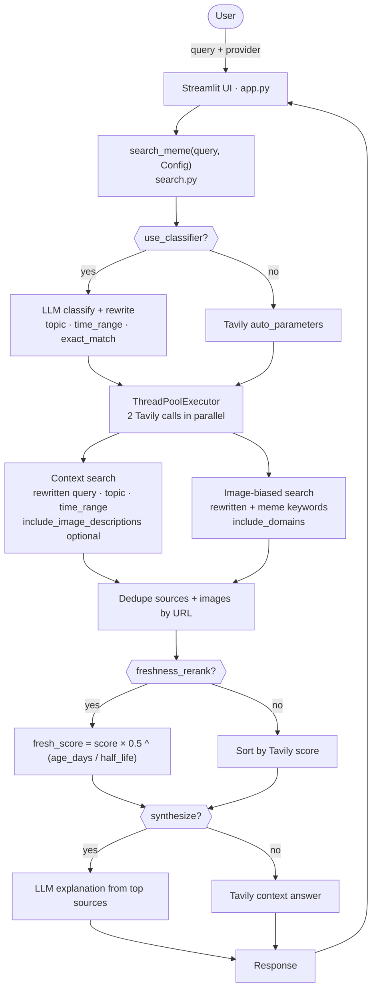

# Stampy Trend Scout

Standalone PoC — Stampy with real-time meme and trend awareness. Ask about any meme or cultural reference; it searches the web via Tavily and returns an explanation plus images. Ships with a **provider toggle** so you can A/B OpenAI `gpt-4o-mini` against xAI `grok-4.20-non-reasoning` on the same pipeline.

## Quick start

```bash
pip install -r requirements.txt
streamlit run app.py
```

Requires in `.env`:

- `OPENAI_API_KEY`
- `XAI_API_KEY`
- `TAVILY_API_KEY`

Pick the provider from the dropdown in the UI.

## Architecture



### Why this shape of A/B

Both providers are OpenAI-compatible, so swapping `base_url` + `model` keeps Tavily and orchestration identical. Any behavioural difference comes from the LLM — how it classifies the query, and (when synthesis is on) how it writes the summary. If Grok wins here, the model is the lever. If it is a wash, the next experiment is xAI Responses API with native `web_search` (deeper integration, real-time X data).

### Block notes

- **Classifier** — optional small LLM call sets `topic`, `time_range`, and a rewritten query (e.g. current year for time-bound events). Off: Tavily `auto_parameters` drives search shape.
- **Today's date in classifier prompt** — reduces wrong-year / stale training-data assumptions.
- **Provider switch** — single OpenAI SDK client with `base_url` swap per provider.
- **Parallel Tavily** — one context-wide search and one domain-scoped image-oriented search; results merged and deduped.
- **Freshness re-rank** — multiplicative decay on Tavily relevance: `score × 0.5 ^ (age_days / half_life)`. Uses `published_date` when present.
- **Images** — URLs from Tavily as returned (no HTTP HEAD filtering). `include_image_descriptions` applies to the context call; the image-domain pass disables descriptions to save credits where Tavily returns little anyway.

### Not yet wired

- **xAI Responses API + native `web_search`** — real-time web + X, `enable_image_understanding`. Queued behind this OpenAI-compatible A/B.
- **pytrends** — Google Trends velocity and related queries; optional in code, UI toggle still disabled while rate limits and signal quality are evaluated.
